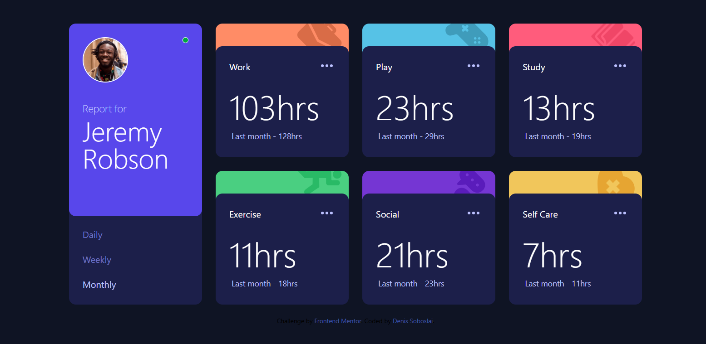

# Frontend Mentor - Time tracking dashboard solution

This is a solution to the [Time tracking dashboard challenge on Frontend Mentor](https://www.frontendmentor.io/challenges/time-tracking-dashboard-UIQ7167Jw). Frontend Mentor challenges help you improve your coding skills by building realistic projects.

## Table of contents

- [Overview](#overview)
  - [The challenge](#the-challenge)
  - [Screenshot](#screenshot)
  - [Links](#links)
- [My process](#my-process)
  - [Built with](#built-with)
  - [What I learned](#what-i-learned)
  - [Continued development](#continued-development)
  - [AI Collaboration](#ai-collaboration)
- [Author](#author)

## Overview

### The challenge

Users should be able to:

- View the optimal layout for the site depending on their device's screen size
- See hover states for all interactive elements on the page
- Switch between viewing Daily, Weekly, and Monthly stats

### Screenshot

### Links

- Solution URL: [Add solution URL here](https://github.com/denissoboslai13/frontend-mentor-time-tracking-dash)
- Live Site URL: [Add live site URL here](https://denissoboslai13.github.io/frontend-mentor-time-tracking-dash/)

## My process

### Built with

- Semantic HTML5 markup
- CSS custom properties
- Flexbox
- CSS Grid
- Mobile-first workflow
- [React](https://reactjs.org/)
- [Tailwind](https://tailwindcss.com/)
- [Motion](https://motion.dev/)
- [Axios](https://axios-http.com/)

### What I learned

This one was pretty neat, i enjoy working with servers and backend stuff, so it was pretty cool for me. I guess the biggest thing i learned is how to deploy a backend and a frontend seperately, and i got to refresh my http code and axios knowledge.

### Continued development

I think the same as others, just keep building on this, with future challenges and projects.

### AI Collaboration

Once more, i did have to use Claude, but only for the desktop grid, i couldnt quite get the layout right, so i asked him how i should go about it, but i learned what flex shrink and flex grow do, so i guess its not that bad.

## Author

- Frontend Mentor - [@denissoboslai13](https://www.frontendmentor.io/profile/denissoboslai13)
